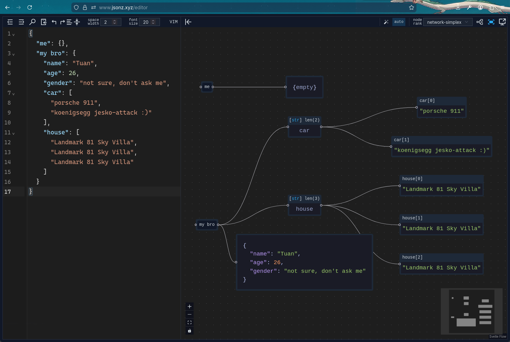

## What's included?

### 🛠️ [Editor & Visualizer](https://www.jsonz.xyz/editor)

A simple but capable JSON editor that formats and validates your data. It also gives you an interactive visual tree, so you can easily explore deeply nested objects without getting lost.

### 🔄 [JSON to YAML](https://www.jsonz.xyz/json-to-yaml)

If you're working with Docker Compose files, Kubernetes manifests, or CI pipelines, you probably prefer YAML. This tool instantly converts your JSON structures into clean YAML.

### 🔍 [Diff Tool](https://www.jsonz.xyz/diff-tool)

Trying to figure out what changed between two massive JSON payloads? The diff tool highlights exactly what was added, removed, or modified so you don't have to squint at your screen to find the differences.

## Why use it?

- **It's private:** Everything runs securely in your browser.
- **It's clean:** No ads, no clutter. Just a minimal, modern UI.
- **It's completely free:** No paywalls or limits.

Give it a spin over at **[jsonz.xyz](https://www.jsonz.xyz)**, and I hope it makes your dev workflow a little smoother!
